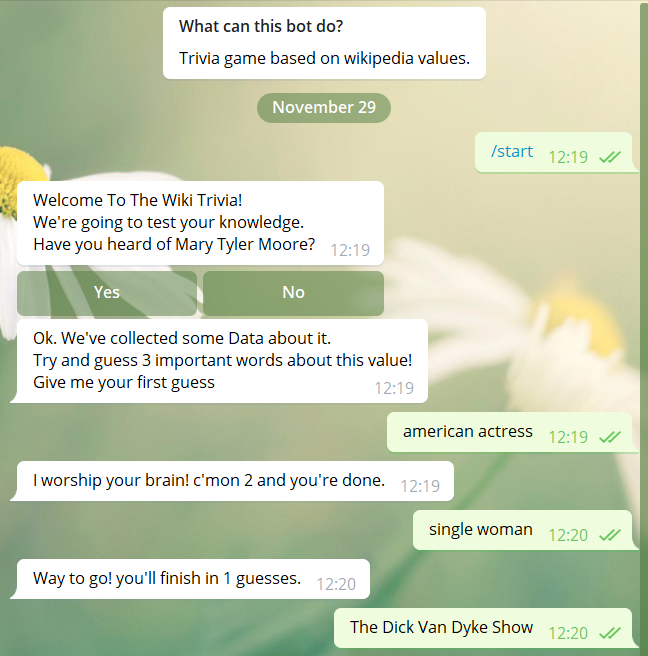
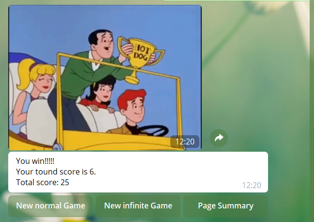
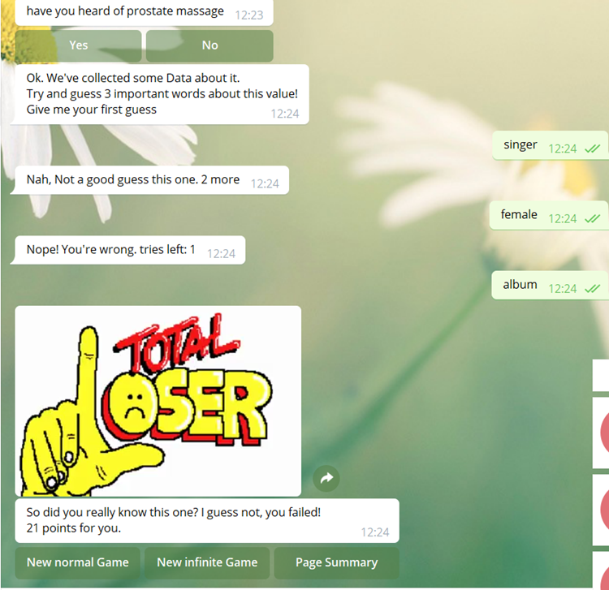
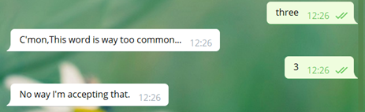
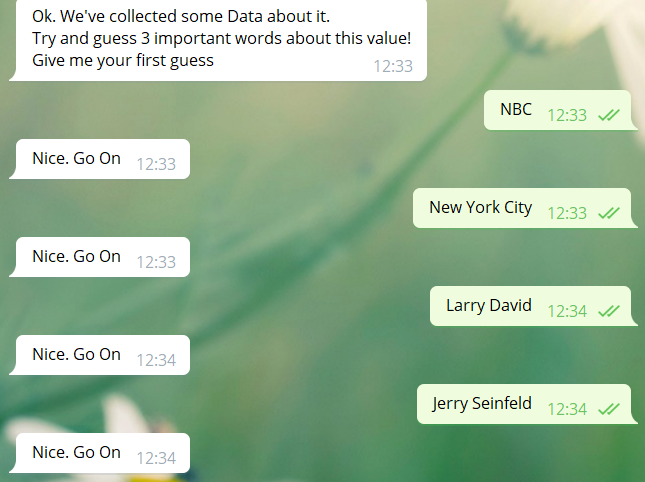

# WikiTrivi
play an infinite trivia game testing your general knowledge <https://t.me/wiki_trivi_bot>

* [Chani Glick](https://github.com/chanismile)
* [Noami Pindrus](https://github.com/noamip)
* Efrat Traube

TriviBot will test your worldly knowledge using popular concepts from the last 5 years. 
 You'll get some wiki pages titles and we'll test your information against the most knowledgeable of them all; Wiki.
 Do Your Worst!

## Screenshots

##### Winning Game

##### Losing Game

##### Hacking the Game

##### Infinite Game

## How to Run This Bot

### Prerequisites
* Python 3.7
* MongoDB
* wikipedia library

### Setup
* Clone this repo from github
* Get a BOT ID from the [botfather](https://telegram.me/BotFather).
* Create a `secret_settings.py` file:

        BOT_TOKEN = "your-bot-token-here"

### Run
To run the bot use:

    python bot.py

### Notes
* You get a large amount of data on the first run 

## Credits and References
* [Telegram Docs](https://core.telegram.org/bots)
* [python-telegram-bot](https://github.com/python-telegram-bot/python-telegram-bot)
* [wikipedia - parse wiki pages python library](https://github.com/goldsmith/Wikipedia)
* [pandas - data analysis python library](https://github.com/pandas-dev/pandas)
* User [West.andrew.g](https://en.wikipedia.org/wiki/User:West.andrew.g) work on wikipedia trends.
* [introduction to scraping tables](https://qxf2.com/blog/web-scraping-using-python/)
* [multiple tables in data](https://www.reddit.com/r/learnpython/comments/6tbrsz/pandas_dataframe_to_csv_attribute_error/)
* [rename the headers](https://chrisalbon.com/python/data_wrangling/pandas_rename_column_headers/)
